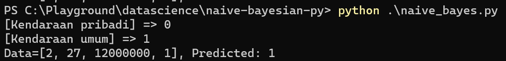
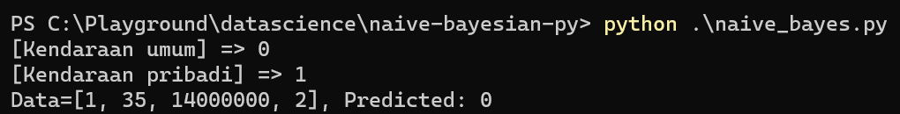

# naive-bayesian-py
Implementation of naive bayesian algorithm in python (for assignment)

### Jenis kelamin
Laki-laki = 1,
Perempuan = 2

### Status
Single = 1,
Menikah = 2

## Hasil

Tambah data (Perempuan, 27, 12000000, Single)

Tambah data (Laki-laki, 35, 14000000, Menikah)
